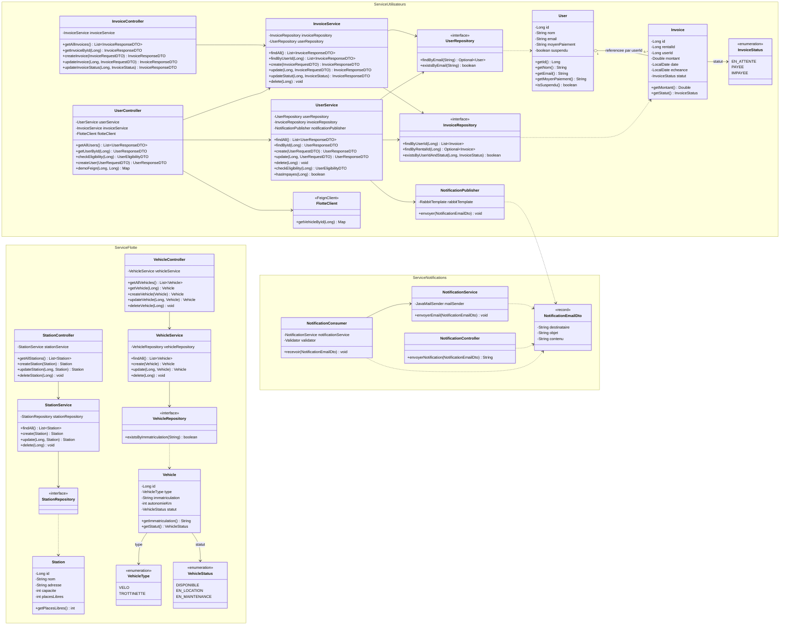

# Diagramme de classes - BikeFlow

```mermaid
classDiagram
    direction LR

    namespace ServiceUtilisateurs {
        class User {
            -Long id
            -String nom
            -String email
            -String moyenPaiement
            -boolean suspendu
            +getId() Long
            +getNom() String
            +getEmail() String
            +getMoyenPaiement() String
            +isSuspendu() boolean
        }

        class Invoice {
            -Long id
            -Long rentalId
            -Long userId
            -Double montant
            -LocalDate date
            -LocalDate echeance
            -InvoiceStatus statut
            +getMontant() Double
            +getStatut() InvoiceStatus
        }

        class InvoiceStatus {
            <<enumeration>>
            EN_ATTENTE
            PAYEE
            IMPAYEE
        }

        class UserService {
            -UserRepository userRepository
            -InvoiceRepository invoiceRepository
            -NotificationPublisher notificationPublisher
            +findAll() List~UserResponseDTO~
            +findById(Long) UserResponseDTO
            +create(UserRequestDTO) UserResponseDTO
            +update(Long, UserRequestDTO) UserResponseDTO
            +delete(Long) void
            +checkEligibility(Long) UserEligibilityDTO
            +hasImpayes(Long) boolean
        }

        class InvoiceService {
            -InvoiceRepository invoiceRepository
            -UserRepository userRepository
            +findAll() List~InvoiceResponseDTO~
            +findByUserId(Long) List~InvoiceResponseDTO~
            +create(InvoiceRequestDTO) InvoiceResponseDTO
            +update(Long, InvoiceRequestDTO) InvoiceResponseDTO
            +updateStatut(Long, InvoiceStatus) InvoiceResponseDTO
            +delete(Long) void
        }

        class UserController {
            -UserService userService
            -InvoiceService invoiceService
            -FlotteClient flotteClient
            +getAllUsers() List~UserResponseDTO~
            +getUserById(Long) UserResponseDTO
            +checkEligibility(Long) UserEligibilityDTO
            +createUser(UserRequestDTO) UserResponseDTO
            +demoFeign(Long, Long) Map
        }

        class InvoiceController {
            -InvoiceService invoiceService
            +getAllInvoices() List~InvoiceResponseDTO~
            +getInvoiceById(Long) InvoiceResponseDTO
            +createInvoice(InvoiceRequestDTO) InvoiceResponseDTO
            +updateInvoice(Long, InvoiceRequestDTO) InvoiceResponseDTO
            +updateInvoiceStatus(Long, InvoiceStatus) InvoiceResponseDTO
        }

        class UserRepository {
            <<interface>>
            +findByEmail(String) Optional~User~
            +existsByEmail(String) boolean
        }

        class InvoiceRepository {
            <<interface>>
            +findByUserId(Long) List~Invoice~
            +findByRentalId(Long) Optional~Invoice~
            +existsByUserIdAndStatut(Long, InvoiceStatus) boolean
        }

        class FlotteClient {
            <<FeignClient>>
            +getVehicleById(Long) Map
        }

        class NotificationPublisher {
            -RabbitTemplate rabbitTemplate
            +envoyer(NotificationEmailDto) void
        }
    }

    namespace ServiceFlotte {
        class Station {
            -Long id
            -String nom
            -String adresse
            -int capacite
            -int placesLibres
            +getPlacesLibres() int
        }

        class Vehicle {
            -Long id
            -VehicleType type
            -String immatriculation
            -int autonomieKm
            -VehicleStatus statut
            +getImmatriculation() String
            +getStatut() VehicleStatus
        }

        class VehicleType {
            <<enumeration>>
            VELO
            TROTTINETTE
        }

        class VehicleStatus {
            <<enumeration>>
            DISPONIBLE
            EN_LOCATION
            EN_MAINTENANCE
        }

        class StationService {
            -StationRepository stationRepository
            +findAll() List~Station~
            +create(Station) Station
            +update(Long, Station) Station
            +delete(Long) void
        }

        class VehicleService {
            -VehicleRepository vehicleRepository
            +findAll() List~Vehicle~
            +create(Vehicle) Vehicle
            +update(Long, Vehicle) Vehicle
            +delete(Long) void
        }

        class StationController {
            -StationService stationService
            +getAllStations() List~Station~
            +createStation(Station) Station
            +updateStation(Long, Station) Station
            +deleteStation(Long) void
        }

        class VehicleController {
            -VehicleService vehicleService
            +getAllVehicles() List~Vehicle~
            +getVehicle(Long) Vehicle
            +createVehicle(Vehicle) Vehicle
            +updateVehicle(Long, Vehicle) Vehicle
            +deleteVehicle(Long) void
        }

        class StationRepository {
            <<interface>>
        }

        class VehicleRepository {
            <<interface>>
            +existsByImmatriculation(String) boolean
        }
    }

    namespace ServiceNotifications {
        class NotificationEmailDto {
            <<record>>
            -String destinataire
            -String objet
            -String contenu
        }

        class NotificationConsumer {
            -NotificationService notificationService
            -Validator validator
            +recevoir(NotificationEmailDto) void
        }

        class NotificationService {
            -JavaMailSender mailSender
            +envoyerEmail(NotificationEmailDto) void
        }

        class NotificationController {
            +envoyerNotification(NotificationEmailDto) String
        }
    }

    Invoice --> InvoiceStatus : statut
    Vehicle --> VehicleType : type
    Vehicle --> VehicleStatus : statut
    UserService --> UserRepository
    UserService --> InvoiceRepository
    UserService --> NotificationPublisher
    InvoiceService --> InvoiceRepository
    InvoiceService --> UserRepository
    UserController --> UserService
    UserController --> InvoiceService
    UserController --> FlotteClient
    InvoiceController --> InvoiceService
    StationService --> StationRepository
    VehicleService --> VehicleRepository
    StationController --> StationService
    VehicleController --> VehicleService
    UserRepository ..> User
    InvoiceRepository ..> Invoice
    StationRepository ..> Station
    VehicleRepository ..> Vehicle
    NotificationPublisher ..> NotificationEmailDto
    NotificationConsumer --> NotificationService
    NotificationConsumer ..> NotificationEmailDto
    NotificationController ..> NotificationEmailDto
    NotificationService ..> NotificationEmailDto

    User "1" o-- "0..*" Invoice : referencee par userId
```
